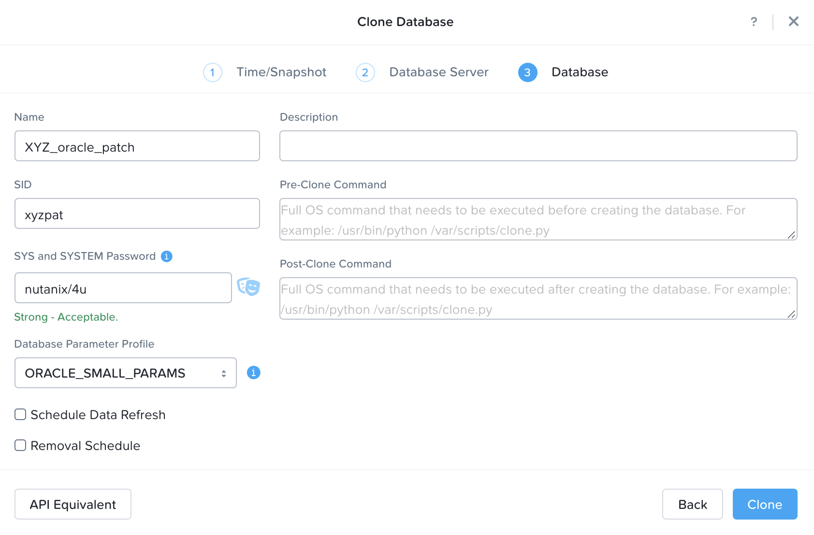

.. _oraclepatch:

------------------
Patching Databases
------------------

Introduction

**In this lab you will...**

Manual Oracle VM Deployment
+++++++++++++++++++++++++++

#. In **Prism Central**, select :fa:`bars` **> Virtual Infrastructure > VMs**.

   .. figure:: images/1.png

#. Click **Create VM**.

#. Select your assigned cluster and click **OK**.

#. Fill out the following fields:

   - **Name** - *Initials*\ _oracle_base
   - **Description** - (Optional) Description for your VM.
   - **vCPU(s)** - 2
   - **Number of Cores per vCPU** - 1
   - **Memory** - 8 GiB

   - Select **+ Add New Disk**
      - **Type** - DISK
      - **Operation** - Clone from Image Service
      - **Image** - Oracle19c_bootdisk.qcow2
      - Select **Add**

   - Select **+ Add New Disk**
      - **Type** - DISK
      - **Operation** - Clone from Image Service
      - **Image** - Oracle19c_disk1.qcow2
      - Select **Add**

   - Select **+ Add New Disk**
      - **Type** - DISK
      - **Operation** - Clone from Image Service
      - **Image** - Oracle19c_disk2.qcow2
      - Select **Add**

   - Select **+ Add New Disk**
      - **Type** - DISK
      - **Operation** - Clone from Image Service
      - **Image** - Oracle19c_disk3.qcow2
      - Select **Add**

   - Select **+ Add New Disk**
      - **Type** - DISK
      - **Operation** - Clone from Image Service
      - **Image** - Oracle19c_disk4.qcow2
      - Select **Add**

   - Select **+ Add New Disk**
      - **Type** - DISK
      - **Operation** - Clone from Image Service
      - **Image** - Oracle19c_disk5.qcow2
      - Select **Add**

   - Select **+ Add New Disk**
      - **Type** - DISK
      - **Operation** - Clone from Image Service
      - **Image** - Oracle19c_disk6.qcow2
      - Select **Add**

    - Select **+ Add New Disk**
      - **Type** - DISK
      - **Operation** - Clone from Image Service
      - **Image** - Oracle19c_disk7.qcow2
      - Select **Add**

    - Select **+ Add New Disk**
      - **Type** - DISK
      - **Operation** - Clone from Image Service
      - **Image** - Oracle19c_disk8.qcow2
      - Select **Add**

    - Select **+ Add New Disk**
      - **Type** - DISK
      - **Operation** - Clone from Image Service
      - **Image** - Oracle19c_disk9.qcow2
      - Select **Add**

   - Select **Add New NIC**
      - **VLAN Name** - *Assigned User VLAN*
      - Select **Add**

#. Click **Save** to create the VM.

#. Select your VM and click **Actions > Power On**.

.. #. Once powered on, click **Actions > Launch Console** and complete Windows Server setup:

   Registering Production Oracle VM
   ++++++++++++++++++++++++++++++++

   Unlike the MS SQL labs, the intention here is to directly register a database, along with the database server, in order to manage your production Oracle database with Era.

   #. In **Era**, select **Databases** from the dropdown menu and **Sources** from the lefthand menu.

      .. figure:: images/1.png

   #. Click **+ Register** and fill out the following **Database Server** fields:

      - **Engine** - Oracle
      - **Database is on a Server this is** - Not Registered
      - **IP Address or Name of VM** - *Initials*\ -OracleProd
      - **Era Drive User** - oracle

         *The Era Drive User can be any user on the VM that has sudo access with NOPASSWD setting. Era will use this user's credentials to perform various operations, such as taking snapshots.*

      - **Oracle Database Home** - /u02/app/oracle/product/19.0.0/dbhome_1

         *This is the directory where the Oracle database software is installed, and is a mandatory parameter for registering a database server.*

      - **Provide Credentials Through** - Password
      - **Password** - Nutanix/4u

      .. figure:: images/2.png

   #. Click **Next**, and fill out the following **Database** fields:

      - **Database Name in Era** - *Initials*\ _ORCL19C
      - **SID** - orcl18c

         *What is the SID?*

      .. figure:: images/3.png

   #. Click **Next**, and modify the following **Time Machine** default values:

      - **SLA** - DEFAULT_OOB_GOLD_SLA

      .. figure:: images/4.png

   #. Click **Register** to begin registering both the Database Server and the existing Database on your production Oracle VM.

   #. Select **Operations** from the dropdown menu to monitor the registration. This process should take approximately 5 minutes.

Register Oracle Server with Era
+++++++++++++++++++++++++++++++

Similar to the MS SQL labs, the intention here is to create a new Oracle database server VM based on the imported profile.

#. In **Era**, select **Database Servers** from the dropdown menu and **List** from the lefthand menu.

#. Click **+ Register**.

#. In the First **Register Database Server** Dialog box, select **Oracle**, and click **Next**.

#. Click **+ Register** and fill out the following **Database Server** fields:

   - **Engine** - Oracle
   - **IP Address or Name of VM** - *Initials*\ _oracle_base
   -  **Database Version** - 19.0.0.0
   - **Era Drive User** - oracle

      *The Era Drive User can be any user on the VM that has sudo access with NOPASSWD setting. Era will use this user's credentials to perform various operations, such as taking snapshots.*

   - **Oracle Database Home** - /u02/app/oracle/product/19.0.0/dbhome_1

      *This is the directory where the Oracle database software is installed, and is a mandatory parameter for registering a database server.*

   -  **Grid Infrastructure Home** - /u01/app/19.0.0/grid

      *This is the directory where the Oracle Grid Infrastructure software is installed. This is only applicable for Oracle RAC or SIHA databases.*

   - **Provide Credentials Through** - Password
   - **Password** - Nutanix/4u

   .. figure:: images/registerdb_01.png

#. Click **Register** and monitor the progress on the **Operations** page. This process should take approximately 2 minutes.

   .. note::

   Wait for the registration operation to successfully complete before moving on.

Create Base Software Profile
++++++++++++++++++++++++++++

Once the *Initials*\ **_oracle_base** server has been registered with Era, we need to create a software profile in order to deploy additional Oracle VMs.

#. Select **Profiles** from the dropdown menu and **Software** from the lefthand menu.

#. Click **+ Create** and fill out the following fields:

   - **Engine** - Oracle
   - **Type** - Single Instance
   - **Name** - *Initials*\ _ORACLE_BASE
   - **Description** - (Optional)
   - **Database Server** - Select your registered *Initials*\ _oracle_base VM

   .. figure:: images/5.png

#. Click **Create**.

#. Select **Operations** from the dropdown menu to monitor the registration. This process should take approximately 5 minutes.

#. Once the profile creation completes successfully, power off your *Initials*\ **_oracle_base** VM in Prism.

Create Oracle Server with Era
+++++++++++++++++++++++++++++++

<Here we will create our production Oracle database server which will eventually be patched>

#. Select **Databases** from the dropdown menu and **Sources** from the lefthand menu.

#. Click **+ Provision > Single Node Database**.

#. In the **Provision a Database** wizard, fill out the following fields to configure the Database Server:

   - **Engine** - Oracle
   - **Database Server** - Create New Server
   - **Database Server Name** - *Initials*\ _oracle_prd
   - **Description** - (Optional)
   - **Software Profile** - *Initials*\ _ORACLE_BASE
   - **Compute Profile** - ORACLE_MEDIUM
   - **Network Profile** - *User VLAN*\ _ORACLE_NETWORK
   - Select **Enable High Availability**
   - **SYS ASM Password** - oracle

   *What is this?*

   - **SSH Public Key for Node Access** -

      ::

         ssh-rsa AAAAB3NzaC1yc2EAAAABJQAAAQEAii7qFDhVadLx5lULAG/ooCUTA/ATSmXbArs+GdHxbUWd/bNGZCXnaQ2L1mSVVGDxfTbSaTJ3En3tVlMtD2RjZPdhqWESCaoj2kXLYSiNDS9qz3SK6h822je/f9O9CzCTrw2XGhnDVwmNraUvO5wmQObCDthTXc72PcBOd6oa4ENsnuY9HtiETg29TZXgCYPFXipLBHSZYkBmGgccAeY9dq5ywiywBJLuoSovXkkRJk3cd7GyhCRIwYzqfdgSmiAMYgJLrz/UuLxatPqXts2D8v1xqR9EPNZNzgd4QHK4of1lqsNRuz2SxkwqLcXSw0mGcAL8mIwVpzhPzwmENC5Orw==

   .. figure:: images/6.png

#. Click **Next**, and fill out the following fields to configure the Database:

   -  **Database Name** - *Initials*\ _prddb
   -  **SID** - *Initials*\ prd
   -  **SYS and SYSTEM Password** - nutanix/4u
   -  **Database Parameter Profile** - ORACLE_MEDIUM_PARAMS

   .. figure:: images/7.png

   <Info about common use cases for pre and post scripts and encryption>

#. Click **Next** and fill out the following fields to configure the Time Machine for your database:

   - **Name** - *Initials*\ _oracle_prod_TM (Default)
   - **Description** - (Optional)
   - **SLA** - DEFAULT_OOB_GOLD_SLA
   - **Schedule** - (Defaults)

   .. figure:: images/8.png

#. Click **Provision** to begin creating your new database server VM and *Initials*\ **prd** database.

#. Select **Operations** from the dropdown menu to monitor the provisioning. This process should take approximately 45 minutes.

Create Prod Software Profile
++++++++++++++++++++++++++++

Once the *Initials*\ **_oracle_prod** database has been registered with Era, the Time Machine for the database will start creating snapshots and collecting transaction log backups.

#. Select **Profiles** from the dropdown menu and **Software** from the lefthand menu.

#. Click **+ Create** and fill out the following fields:

   - **Engine** - Oracle
   - **Type** - Single Instance
   - **Name** - *Initials*\ _ORACLE_PROD
   - **Description** - (Optional)
   - **Database Server** - Select your registered *Initials*\ _oracle_prd VM

   .. figure:: images/9.png

#. Click **Create**.

#. Select **Operations** from the dropdown menu to monitor the registration. This process should take approximately 5 minutes.

Create Clone for Patching
+++++++++++++++++++++++++

#. In **Era**, select **Time Machines** from the dropdown menu.

#. Select the Time Machine associated with your production database (e.g. *XYZ_prddb_TM*).

..   #. Select **Actions > Snapshot**, specify a name for your snapshot and click **Create**.

      .. figure:: images/12.png

   #. After snapshot creation succeeds, select **Actions > Clone Database > Single Node Database**.

   #. Select your previously created snapshot and click **Next**.

      .. figure:: images/13.png

#. Click **Next** to create a clone based on the latest available Point in Time.

#. Make the following selections and click **Next**:

   - **Database Server** - Create New Server
   - **Database Server Name** - *Initials*\ _oracle_patch
   - **Compute Profile** - ORACLE_MEDIUM
   - **Network Profile** - *User Assigned VLAN*\ _ORACLE_NETWORK
   - **SSH Public Key for Node Access** -

      ::

         ssh-rsa AAAAB3NzaC1yc2EAAAABJQAAAQEAii7qFDhVadLx5lULAG/ooCUTA/ATSmXbArs+GdHxbUWd/bNGZCXnaQ2L1mSVVGDxfTbSaTJ3En3tVlMtD2RjZPdhqWESCaoj2kXLYSiNDS9qz3SK6h822je/f9O9CzCTrw2XGhnDVwmNraUvO5wmQObCDthTXc72PcBOd6oa4ENsnuY9HtiETg29TZXgCYPFXipLBHSZYkBmGgccAeY9dq5ywiywBJLuoSovXkkRJk3cd7GyhCRIwYzqfdgSmiAMYgJLrz/UuLxatPqXts2D8v1xqR9EPNZNzgd4QHK4of1lqsNRuz2SxkwqLcXSw0mGcAL8mIwVpzhPzwmENC5Orw==

   .. figure:: images/10.png

#. Fill out the following fields and click **Clone**:

-  **Name** - (Default)
-  **SID** - *Initials*\ pat (e.g. xyzpat)
-  **Description ** - (Optional) Description
-  **SYS and SYSTEM Password** - nutanix/4u
-  **Database Parameter Profile** - ORACLE_MEDIUM_PARAMS

#. Select **Operations** from the dropdown menu to monitor the database cloning. This process should take approximately 15 minutes.

Apply Patch to Clone
++++++++++++++++++++

#. Select **Databases** from the dropdown menu and **Sources** from the lefthand menu.

#. Click on your *Initials*\ **_oracle_patch** clone to view additional details about the database. Note

#. Click on **initials_oracle_patch**

#. Click **See Description** under Connect via SSH

   .. figure:: images/patchdb_06.png

#. Use the ip address listed to connect to vm from your tools vm with putty
    - **username** - oracle
    - **password** - Nutanix/4u

#. Once logged into the vm type **bash** and press enter

#. run the command below
   - sudo /root/Downloads/applypsu.sh
   - press enter to start patch
   - You can ignore any errors about directories not existing.
# type **exit** three times to exit

Update Software Profile
.......................

Update the software profile of the patched server to use for patching existing server

#. Select the **Era > Getting Started** drop down menu and click **Profiles**.

#. Select **Software** in the **Profiles** pane on the left-hand side of the screen.

#. Chose **initials_oracle_base** and click **View Versions**

#. Chose **initials_oracle_base(1.0)** and click **+ Create**

#. On the **Crate Software Profile** chose the server you cloned input the following and click **create**:
    -  **Name** - initials_oracle_patched
    -  **Description** - (Optional) Description

.. figure:: images/patchdb_05.png

#. Select initials_oracle_patched to check the progress

#. Once creation of profile is complete, go back to **Software Profiles**

#. Chose **initials_oracle_prod** and click **View Versions**

#. Chose **initials_oracle_patched** and click **Update**

#. Select **Published** and click **Next** until you can click **Update**

.. figure:: images/patchdb_07.png

Patch Prod Sever
................

Now that we have a published patched software profile we can patch your original "Prod" Servers

#. Select the **Era >** drop down menu and click **Database Servers**.

#. Under Oracle Click on **Source DB Servers**

#. Select on  **initials_oracle_prod**

#. Scroll Down to Profiles, you should see update available

.. figure:: images/patchdb_08.png

#. Select **Update**

#. On Patch 1 Database(s) on server Screen make sure Now is selected and click patch Database

.. figure:: images/patchdb_09.png

#. Click on operations to see patch progress
