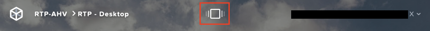
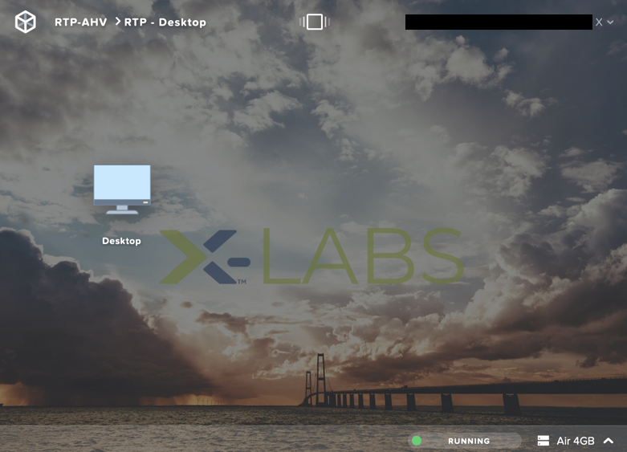

.. _clusteraccess:

----------------------
Accessing Your Cluster
----------------------

Clusters used for **Hands on Learning** run within the Hosted POC environment, hosted in the Nutanix PHX and RTP data centers.

In order to access these resources you must be connected by one of the options listed below. Connection to a virtual desktop environment **is not necessary**, but details for connecting to the HPOC through an HTML5 Frame desktop is available for those experiencing issues with the VPN or unable to install VPN software.

.. note::

  Certain labs leverage a Windows VM with pre-installed tools to provide a controlled environment. It is **highly recommended** that you connect to these Windows VMs using the Microsoft Remote Desktop client rather than the VM console launched via Prism. An RDP connection will allow you to copy and paste between your device and the VMs.

.. .. raw:: html

  <strong>If you encounter issues connecting to the VPN, Nutanix IT Helpdesk is available via...</strong>

Nutanix Employees
.................

Log in to https://gp.nutanix.com using your OKTA credentials.

Download and install the appropriate GlobalProtect agent for your operating system.

Launch GlobalProtect and configure **gp.nutanix.com** as the **Portal** address.

Connect using your **Okta** credentials.

.. note::

  Using the **Gateway** dropdown, select a Split Tunnel (ST) gateway to ensure only network traffic targeting the Hosted POC environment is sent over the VPN. Otherwise **Best Available** will default to a full VPN tunnel. Regardless if using a **PHX** or **RTP** cluster, **Phoenix (ST)** and **Reno (ST)** are recommended. Do not use the **Durham (ST)** option.

  .. figure:: images/gp.png

.. note::

   If you experience issues connecting to the GlobalProtect VPN, Nutanix IT resources are on standby in #corp-it on Slack to assist.

Partner VPN
...........

Log in to https://xlv-uswest1.nutanix.com using the following credentials:

- **Username** - Refer to :ref:`clusterassignments` for your **Lab VPN Username**
- **Password** - techX2020!

Under **Client Application Sessions**, click **Start** to the right of **Pulse Secure** to download the client.

Install and open **Pulse Secure**.

Add a connection:

- **Type** - Policy Secure (UAC) or Connection Server
- **Name** - HPOC VPN
- **Server URL** - https://xlv-uswest1.nutanix.com

.. figure:: images/pulse.png

Connect using the provided credentials.

Partner Frame Desktop
.....................

Verify in :ref:`clusterassignments` if you have been assigned to a **PHX** or **RTP** cluster.

Log into https://frame.nutanix.com/x/labs using the following credentials:

- **Username** - Refer to :ref:`clusterassignments` for your **Lab VPN Username**
- **Password** - techX2020!

Accept the Nutanix Cloud Services Terms of Service.

Click the **Launchpads** icon at the top of the screen.

Select a **Launchpad** that corresponds to your cluster location (**PHX** v. **RTP**).

.. figure:: images/frame3.png

.. note::

   PHX has multiple pools of Frame desktops available to access PHX clusters, you can choose any of them.

Launch the **Desktop**.

Click the **Fullscreen** icon in the lower, right hand of the Frame status bar to maximize the virtual desktop.
